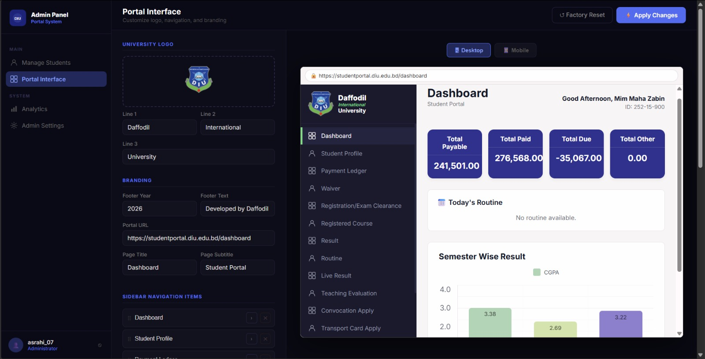
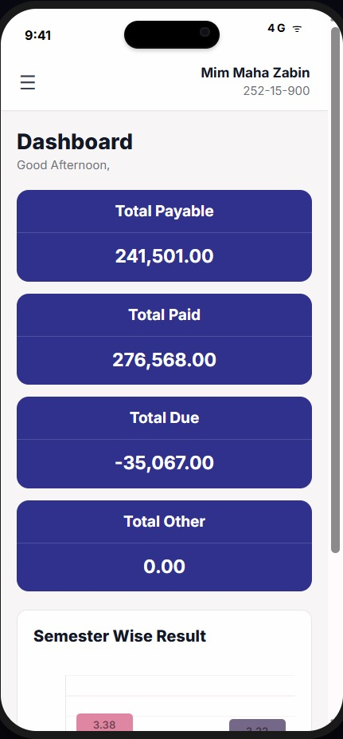
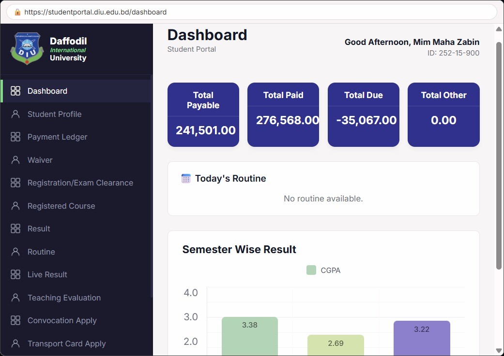

# 🎓 DIU Portal Generator & System


A powerful, single-page web application designed to generate customizable mockups of the Daffodil International University (DIU) Student Portal. This tool features a fully functional simulated database, dual-login environments (Admin & Student), and real-time UI generation for both desktop and mobile views.

> ⚠️ **Disclaimer:** This project is created for educational, UI/UX demonstration, and harmless mockup purposes only. It is not affiliated with Daffodil International University. Please do not use this tool for malicious intent or fraud.

---

## ✨ Key Features

* **Dual Environment System:** Separate, secure login flows for Administrators and Students.
* **Admin Dashboard:**
    * **Student Management:** Add, edit, approve, and delete student profiles.
    * **Data Control:** Modify financial data (Total Payable, Paid, Due) and semester-wise CGPA values dynamically.
    * **Portal Customization:** Upload custom university logos, change branding text, and reorder/edit sidebar navigation items.
* **Student Dashboard:**
    * Students can request access from the login screen (requires Admin approval).
    * Once approved, students can log in to view and generate their own customized portal mockup.
* **Real-time Mockup Generation:** Instantly visualize changes in high-fidelity Desktop or Mobile device frames (complete with a modern Dynamic Island UI).
* **1-Click Export:** Download high-quality PNG screenshots of the generated portals using integrated `html2canvas`.
* **Local Storage Database:** No backend required! All data, configurations, and student profiles are saved locally in the browser.

---

## 🚀 Quick Start

Because this project is built with Vanilla HTML, CSS, and JS, there is no complex build process or server required.

1.  **Clone the repository:**
    ```bash
    git clone [https://github.com/asrahi-7/DIU-Fake-Portal.git](https://github.com/asrahi-7/DIU-Fake-Portal.git)
    ```
2.  **Open the application:**
    Simply open the `index.html` file in any modern web browser (Chrome, Edge, Firefox, Safari).

*Note: Administrator access is strictly controlled. New students must request access via the login screen and await admin approval before gaining entry to the dashboard.*

---

## 📸 Screenshots

| Admin Dashboard | Student Mobile View | Desktop Portal Mockup |
| :---: | :---: | :---: |
|  |  |  |

*(Make sure to upload your screenshots to an `assets` folder in your repo to make these images visible).*

---

## 🛠️ Technologies Used

* **HTML5 & CSS3:** For structuring and styling the responsive, dark-mode native UI.
* **Vanilla JavaScript:** For DOM manipulation, state management, and handling local storage.
* **[html2canvas](https://html2canvas.hertzen.com/):** For capturing and rendering the DOM elements into downloadable PNG images.

---

## 🤝 Contributing

Contributions, issues, and feature requests are welcome! 
If you have ideas to improve the UI or add new features, feel free to fork this repository and submit a pull request.

---

## 📜 License

This project is licensed under the MIT License - see the [LICENSE](LICENSE) file for details.
